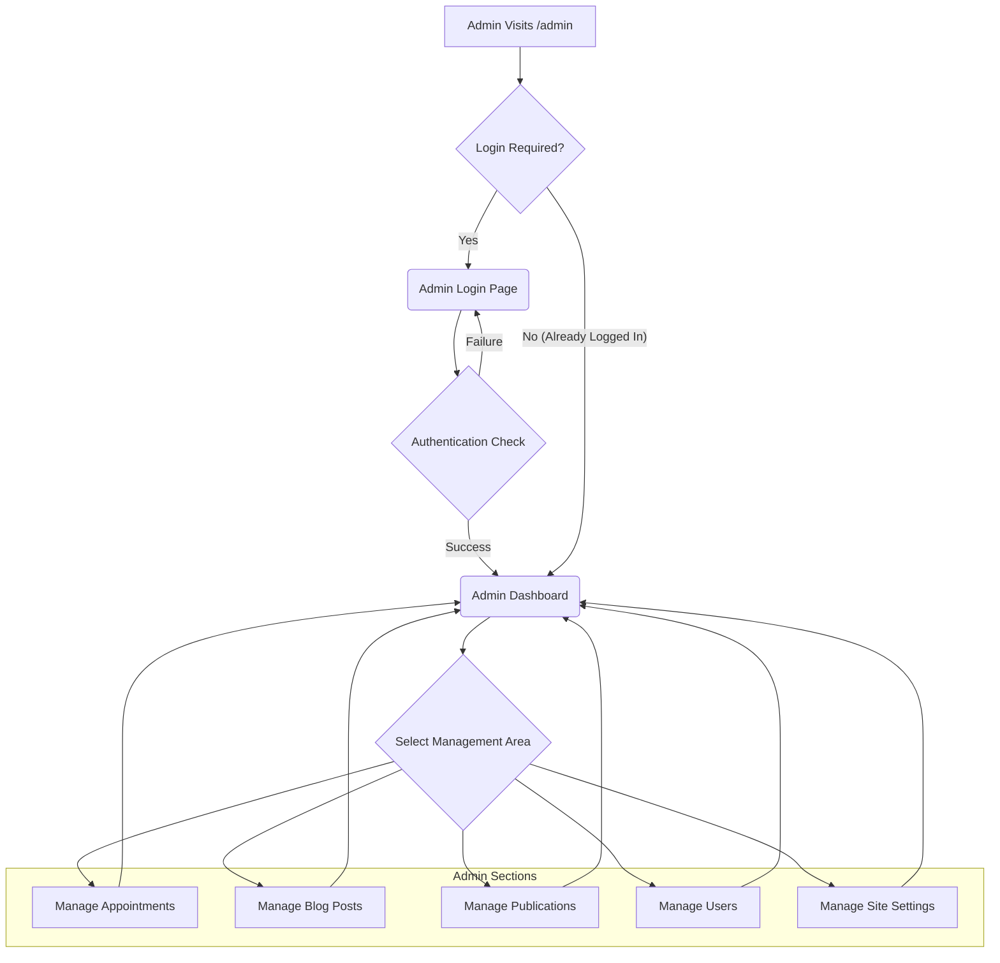

# Application Flow and Structure

This document outlines the main user flows, admin processes, and design system elements of the Sports Orthopedics website.

## Main Website Navigation

This flowchart shows how a typical user might navigate through the public-facing pages of the website.

```mermaid
graph TD
    A[User Visits Site] --> B(Homepage `/homepage`);
    B --> C{Explore Content};
    C --> D[/bone-joint-school/... (Specialty Pages)];
    C --> E[/blogs/ (Blog)];
    C --> F[/publications/ (Publications)];
    C --> G[/contact/ (Contact Page)];
    C --> H{Book Appointment?};
    D --> H;
    E --> H;
    F --> H;
    G --> H;
    H -- Yes --> I(Booking Modal);
    H -- No --> J[User Exits or Browses More];
    I --> K(Submits Request);
    K --> L[Confirmation/Thank You];
    L --> J;

    subgraph "Key Pages"
        B;
        D;
        E;
        F;
        G;
    end

    subgraph "Actions"
        H;
        I;
        K;
    end
```

## Admin / CMS Flow (Conceptual)

This flowchart depicts a likely flow for administrators managing the website content or bookings. The exact implementation might vary.



## Booking Modal Flow

This outlines the steps involved when a user interacts with the booking modal.

```mermaid
graph TD
    BA[User Clicks 'Book Appointment'/'Request Consultation'] --> BB(Booking Modal Opens);
    BB --> BC{Select Doctor/Specialty? (If applicable)};
    BC --> BD{Select Date/Time};
    BD --> BE{Enter Patient Details (Name, Contact, etc.)};
    BE --> BF{Review Information};
    BF --> BG[Submit Request];
    BG --> BH{API Call to Backend};
    BH -- Success --> BI[Show Confirmation Message];
    BH -- Failure --> BJ[Show Error Message];
    BI --> BK(Modal Closes);
    BJ --> BB; // Or allow retry
    BK --> BL[User Continues Browsing];

    subgraph "User Interaction"
        BA;
        BC;
        BD;
        BE;
        BF;
        BG;
    end

    subgraph "System Interaction"
        BH;
        BI;
        BJ;
    end
```

## Design System & Styling

*   **Foundation:** [Tailwind CSS](https://tailwindcss.com/) is used for utility-first styling.
*   **Configuration:** Customizations (colors, fonts, keyframes, etc.) are defined in `tailwind.config.js`.
*   **Components:**
    *   Likely utilizes [Shadcn/ui](https://ui.shadcn.com/) principles/components, built on top of [Radix UI](https://www.radix-ui.com/) primitives for accessibility and functionality.
    *   Reusable components are organized within `src/components/`.
    *   Core UI elements (Buttons, Inputs, Cards, etc.) are likely located in `src/components/ui/`.
*   **Animation:** [Framer Motion](https://www.framer.com/motion/) is used for UI animations and transitions.
*   **Responsiveness:** The design is responsive and adapts to different screen sizes (mobile, tablet, desktop).
*   **Dark Mode:** Configured in `tailwind.config.js`, likely toggled via class. 